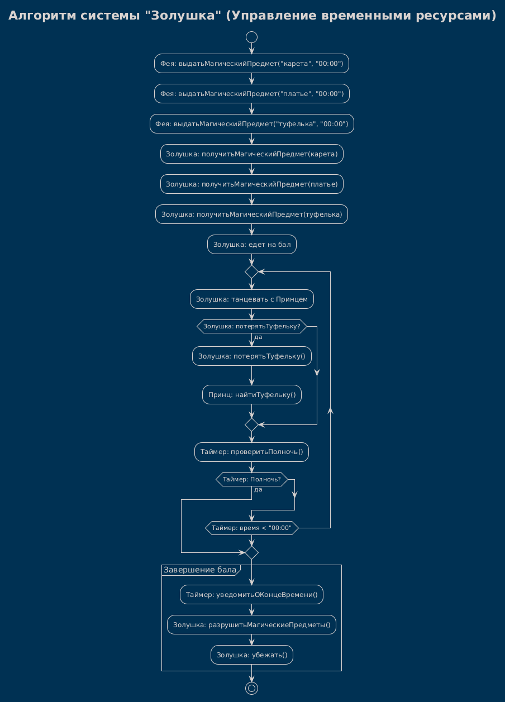

# Activity Diagram: Алгоритм системы "Золушка" (Управление временными ресурсами)

## Обзор

Эта диаграмма активности показывает алгоритм работы системы "Золушка" — управление временными ресурсами и магическими предметами.

---

## Описание потока

### Шаг 1: Подготовка к балу
- **Фея** выдает Золушке магические предметы:
  - карета (время действия: до 00:00)
  - платье (время действия: до 00:00)
  - туфелька (время действия: до 00:00)
- **Золушка** получает все предметы.

### Шаг 2: Поездка на бал
- **Золушка** едет на бал.

### Шаг 3: Танцы с Принцем
- **Золушка** танцует с Принцем.
- **Проверка**: потеряла ли Золушка туфельку?
  - Если **да**:
    - **Золушка** теряет туфельку.
    - **Принц** находит туфельку.
  - Если **нет**: продолжаются танцы.

- **Таймер** проверяет, наступила ли полночь.
  - Если **да**: цикл прерывается.
  - Если **нет**: танцы продолжаются.

### Шаг 4: Завершение бала
- **Таймер** уведомляет о конце времени.
- **Золушка** разрушает магические предметы.
- **Золушка** убегает.

---

## Точки принятия решений
   Условие | Результат |
 |---------|-----------|
 | Золушка: потерятьТуфельку? | Да/Нет |
 | Таймер: Полночь? | Да (прерывание цикла) / Нет (продолжение танцев) |

---
## Диаграмма



## Диаграмма

```plantuml
@startuml
!theme blueprint
skinparam conditionStyle inside
title Алгоритм системы "Золушка" (Управление временными ресурсами)

start
:Фея: выдатьМагическийПредмет("карета", "00:00");
:Фея: выдатьМагическийПредмет("платье", "00:00");
:Фея: выдатьМагическийПредмет("туфелька", "00:00");

:Золушка: получитьМагическийПредмет(карета);
:Золушка: получитьМагическийПредмет(платье);
:Золушка: получитьМагическийПредмет(туфелька);

:Золушка: едет на бал;

repeat
    :Золушка: танцевать с Принцем;
    if (Золушка: потерятьТуфельку?) then (да)
        :Золушка: потерятьТуфельку();
        :Принц: найтиТуфельку();
    endif
    :Таймер: проверитьПолночь();
    if (Таймер: Полночь?) then (да)
        break
    endif
repeat while (Таймер: время < "00:00")

partition "Завершение бала" {
    :Таймер: уведомитьОКонцеВремени();
    :Золушка: разрушитьМагическиеПредметы();
    :Золушка: убежать();
}

stop
@enduml
