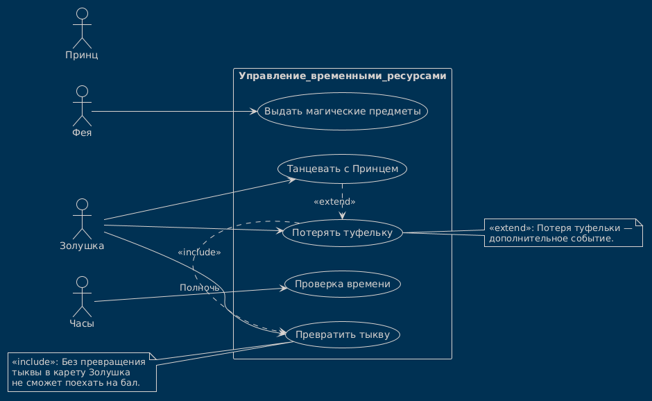

# Use Case Diagram: Система "Золушка" (Управление временными ресурсами)

## Обзор

Эта диаграмма вариантов использования описывает взаимодействие акторов (Фея, Золушка, Принц, Часы) с системой "Золушка" для управления временными ресурсами и магическими предметами.

---

## Акторы
   Актор       | Описание |
 |-------------|----------|
 | **Фея**     | Выдает магические предметы Золушке. |
 | **Золушка** | Использует магические предметы, танцует с Принцем, теряет туфельку. |
 | **Принц**   | Участвует в танцах, находит туфельку. |
 | **Часы**    | Отслеживают время, уведомляют о наступлении полуночи. |

---

## Варианты использования
 | Вариант использования | Описание |
 |-----------------------|----------|
 | **Выдать магические предметы** | Фея выдает Золушке карету, платье и туфельку. |
 | **Превратить тыкву** | Золушка превращает тыкву в карету (включено в основной сценарий). |
 | **Танцевать с Принцем** | Золушка танцует с Принцем на балу. |
 | **Потерять туфельку** | Золушка теряет туфельку (расширение основного сценария). |
 | **Проверка времени** | Часы проверяют, наступила ли полночь. |

---

## Диаграмма



## Диаграмма вариантов использования

```plantuml
@startuml Золушка_UseCase
!theme blueprint
left to right direction

actor Фея as Fairy
actor Золушка as Cinderella
actor Принц as Prince
actor Часы as Clock

rectangle Управление_временными_ресурсами {
  Fairy --> (Выдать магические предметы)
  Cinderella --> (Превратить тыкву)
  Cinderella --> (Танцевать с Принцем)
  Cinderella --> (Потерять туфельку)

  (Танцевать с Принцем) ..> (Потерять туфельку) : <<extend>>
  (Потерять туфельку) --> (Превратить тыкву) : <<include>>
  Clock --> (Проверка времени): Полночь
}

note right of (Потерять туфельку)
  Потеря туфельки —
  дополнительное событие.
end note

note left of (Превратить тыкву)
  Без превращения
  тыквы в карету Золушка
  не сможет поехать на бал.
end note
@enduml
